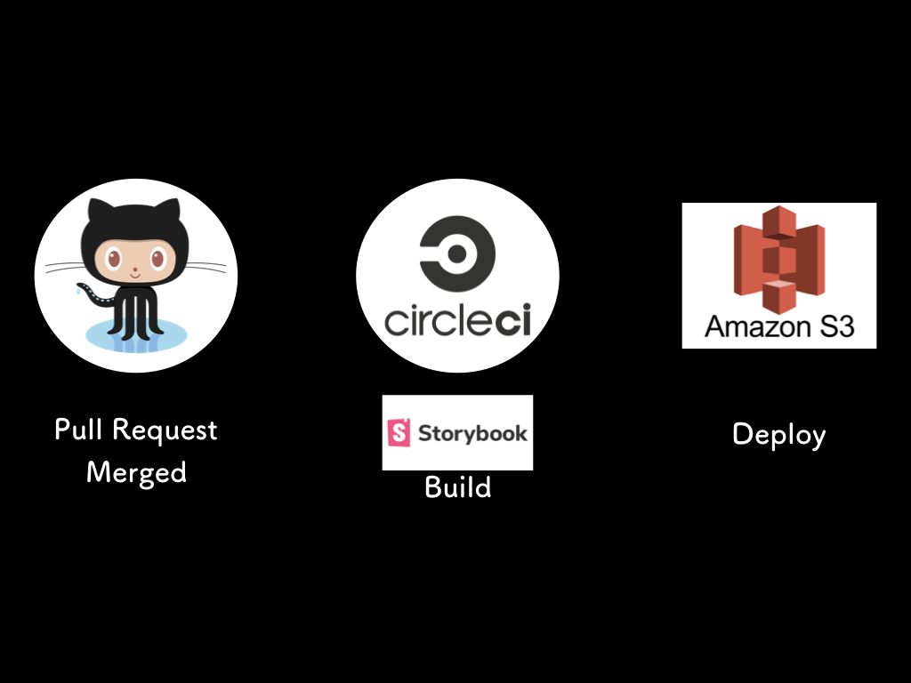

<!-- classes: title -->

## CASE1: Automated storybook deployment to AWS S3

---

<!-- classes: what-is-storybook -->

### What is Storybook?

<p>A kind of ui component list management tool</p>
<p>https://storybook.grommet.io/</p>
<iframe src="https://storybook.grommet.io/?path=/story/all--all"></iframe>

---

<!-- classes: storybook-deploy -->

### Storybook deployment to AWS s3



---

<!-- classes: circleci-config -->

### CircleCI config

```yaml
workflows:
  version: 2
  setup_and_ci:
    jobs:
      - storybook-prod:
          requires:
            - lint
            - test
          filters:
            branches:
              only:
                - master
```

---

<!-- classes: circleci-conifg -->

### CircleCI config

```yaml
steps:
  - run:
      name: Run storybook build
      command: yarn build-storybook
  - run:
      name: Install aws cli
      command: sudo apt-get install awscli
  - run:
      name: upload document
      command: |
        aws configure set preview.cloudfront true
        aws s3 cp ${DIRNAME} s3://${S3_BUCKET}/${CIRCLE_PROJECT_REPONAME} --recursive
  - run:
      name: clear cache of CloudFront
      command: |
        aws cloudfront create-invalidation --distribution-id ${CLOUDFRONT_DISTRIBUTION_ID} --paths /${CIRCLE_PROJECT_REPONAME}/*
```
