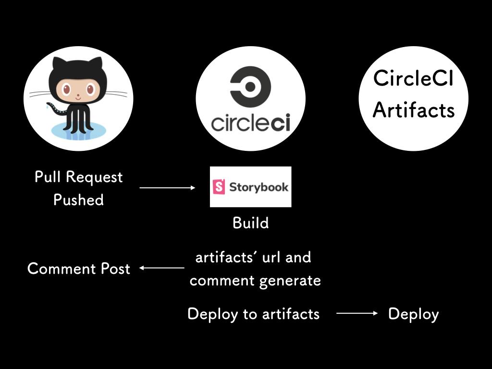

<!-- classes: title -->

## CASE2: support for checking the image of the changed component on Pull Request

---

<!-- classes: storybook-artifacts -->

### Storybook deployment to artifacts



---

<!-- classes: storybook-artifacts -->

### Pull Request comment


---

<!-- classes: storybook-artifacts -->

### Flow image

1. Output the greped difference
2. Generate urls and comment based on difference
3. Post the comment to the pull request

<!-- classes: storybook-artifacts -->

---

### 1. Output the greped difference

```bash
PULL_REQUEST_ID=$(echo $CIRCLE_PULL_REQUEST | awk -F'/' '{print $NF}')

TARGET_BRANCH=$(curl \
  "https://api.github.com/repos/$CIRCLE_PROJECT_USERNAME/$CIRCLE_PROJECT_REPONAME/pulls/$PULL_REQUEST_ID?access_token=$GITHUB_API_TOKEN" \
  | jq -r '.base.ref')

git diff origin/${TARGET_BRANCH}...HEAD --name-only | grep 'components.*\(vue\|stories\.ts\)'
```

<!-- classes: storybook-artifacts -->

---

### 2. Generate urls and comment based on difference

#### Generate hirerarchy

```ts
export const generateHierarchyFromFilepath = (filePath: string): string => {
  const re = filePath.match(
    /.*?components\/(.*?)\/(index\.vue|index\.stories\.ts)?$/
  )
  if (!re) {
    throw new Error('Passed path is invalid')
  }
  return re[1]
}
```

<p>also we can use this function on the stories</p>

```ts
import base from 'paths.macro'
import { generateHierarchyFromFilepath } from '~/utils'

storiesOf(generateHierarchyFromFilepath(base), module)
  .add('foo', () => ({}))
```

---

<!-- classes: storybook-artifacts -->

### 3. Post the comment to the pull request

```ts
const endpoint =
  `https://api.github.com/repos/${CIRCLE_PROJECT_USERNAME}/${CIRCLE_PROJECT_REPONAME}/issues/${PULL_REQUEST_ID}/comments`

await axios.post(
  endpoint,
  {
    body: comment
  },
  {
    headers: {
      Authorization: `Bearer ${GITHUB_API_TOKEN}`,
      Accept: 'application/vnd.github.v3.html+json'
    }
  }
)
```

---

<!-- classes: storybook-artifacts -->

### Whole Code Image

```ts
import { generateHierarchyFromFilepath } from '../utils'

const getModifiedFilesFromStdin = (): Promise<string[]>

const generateStorybookUrlFromHierarchy = (hierarchy: string): string

const generateComment = (
  modifiedStories: { hierarchy: string; url: string }[]
): string

const postCommentToPr = async (comment: string): Promise<void>

;(async (): Promise<void> => {
  const modifiedFiles: string[] = await getModifiedFilesFromStdin()

  if (modifiedFiles.length === 0) {
    process.exit()
  }

  const modifiedStories = modifiedFiles
    .map(generateHierarchyFromFilepath)
    .filter((item, index, array) => array.indexOf(item) === index)
    .map((hierarchy) => ({
      hierarchy,
      url: generateStorybookUrlFromHierarchy(hierarchy)
    }))

  const comment = generateComment(modifiedStories)
  postCommentToPr(comment)
})()
```

---

<!-- classes: storybook-artifacts -->

### Reference

* [PRごとにCIでStorybookをビルドしてデザイナーとインタラクションまで作っていく話](https://qiita.com/resessh/items/38ef6492d0cf21facec8)
